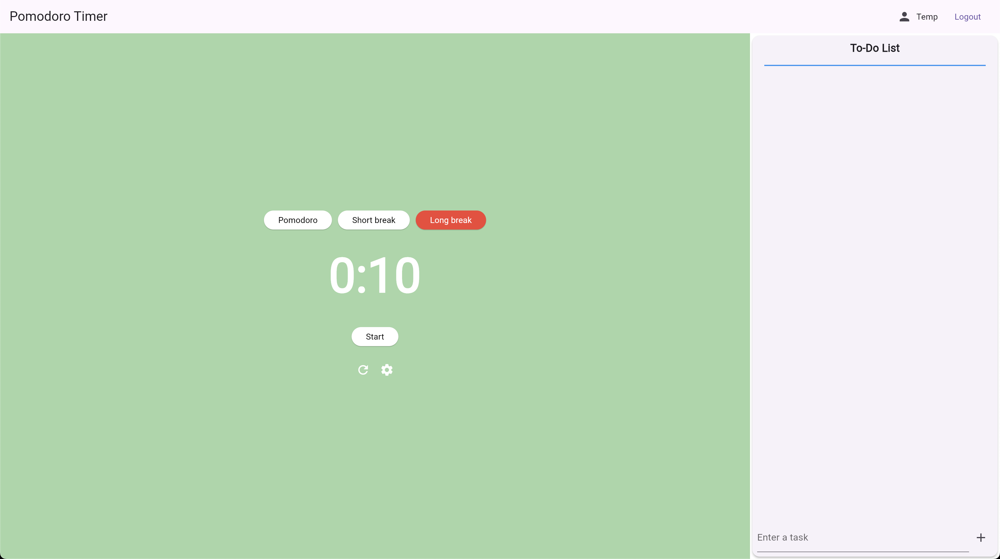
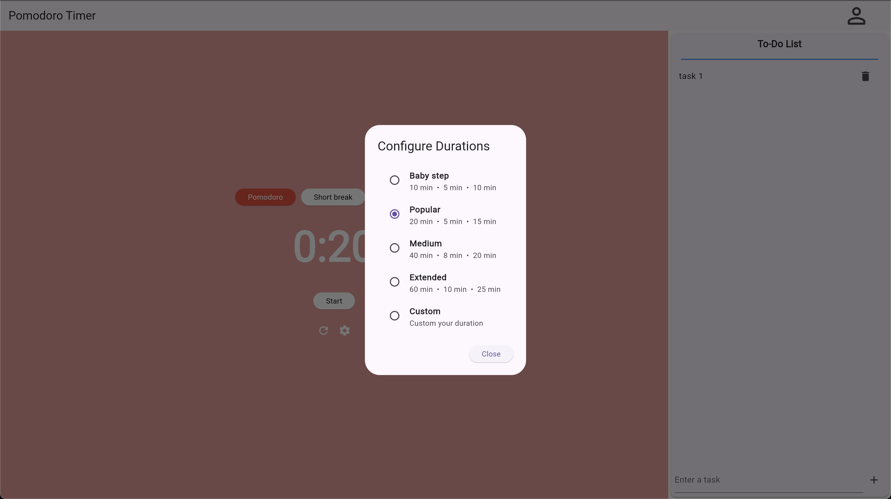
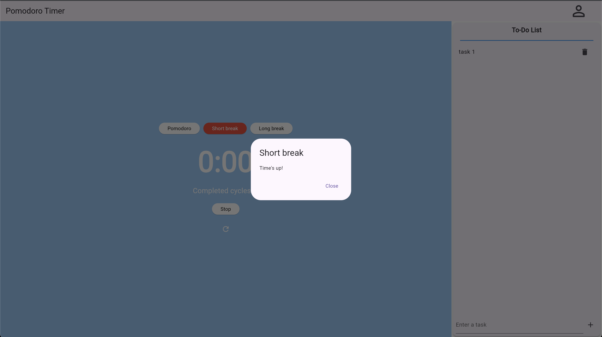
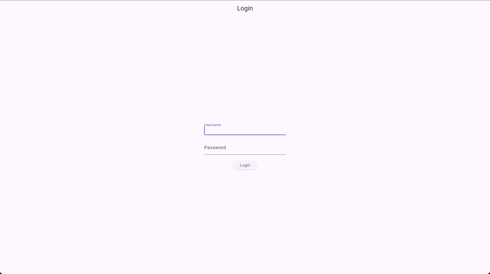

# Podomoro Timer

## Overview

This is my first mini project using Flutter and Dart as requested in a coding interview to explore new technology and assess my self-learning abilities. In addition to the specified requirements, I've expanded and explored different directions to discover new and unfamiliar aspects.

## Table of Contents

- [Project Phases](#project-phases)
- [Site Display](#site-display)
- [Note](#note)

## Project Phases

The first phase focused on learning Dart, followed by Flutter, through documentation and free online courses, including those available on platforms like YouTube. During that phase, I spent time reading, trying to understand, and researching while implementing sample demos to grasp the structure and workflow of programs written in Flutter and Dart.

In the next phase, I proceeded with implementing the assigned project. Apart from striving to meet the logical requirements, I also experimented with unconventional approaches. Of course, during implementation, I encountered numerous errors and faced various challenges, prompting me to switch methods multiple times. Eventually, after resolving these issues, the program ran quite smoothly. I also added new features to further familiarize myself with the technology.

Finally, the application appears to be functioning well, but I am aware that there are still many errors and imperfections. The project may not be fully complete, but I have optimized it to the best of my abilities. I will submit this project after finishing the README file and praying for the best.

## Site Display

</img>
</img>
</img>

</img>

**Here are the demo account details:**

```bash
# User: username - password
User: user - 123
```

## Note

When testing the login feature, it will take quite a while, approximately 1-2 minutes. Alternatively, you can [click here](https://clinic-flask.onrender.com/) beforehand to optimize the waiting time.
